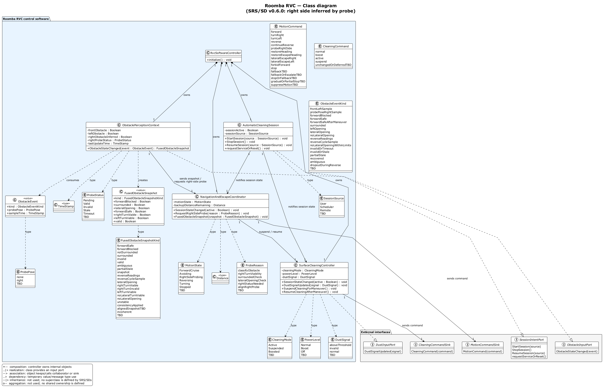

# Roomba RVC — Class Diagram

Companion to the [SD gallery](../sd/RVC_SD_Index.md), [SSD gallery](../ssd/RVC_SSD_Index.md), and [domain model](../domain/RVC_Domain_Diagram.md). This version is aligned with SRS/SD v0.6.0: no dedicated right-side obstacle sensor, direct front/left sensing, and right-side inference by probe-pose observation.

This class diagram is based on:

- SRS §3.2 object names and attributes
- SD messages (`StartSession`, `ObstacleStateChanged`, `FusedObstacleSnapshot`, `MotionCommand`, `CleaningCommand`, etc.)
- External actors / hardware as interfaces, not internal classes

**Source:** `RVC_class.puml`  
**Re-render:** `powershell -NoProfile -ExecutionPolicy Bypass -File ..\render-diagrams.ps1`

## Main Classes

| Class | Source |
|-------|--------|
| `AutomaticCleaningSession` | SRS §3.2.1, UC-01 SD |
| `SurfaceCleaningController` | SRS §3.2.2, UC-02 / UC-06 SD |
| `ObstaclePerceptionContext` | SRS §3.2.3, UC-03 / UC-05 / UC-08 / UC-09 SD |
| `NavigationAndEscapeCoordinator` | SRS §3.2.4, UC-02–UC-05 / UC-07 / UC-08 SD |
| `FusedObstacleSnapshot` | SRS message payload, SD message from perception to navigation |

## External Interfaces

| Interface | Represents |
|-----------|------------|
| `SessionIntentPort` | Home user / scheduler intent |
| `ObstacleInputPort` | Direct front/left obstacle updates and probe-pose observations |
| `DustInputPort` | Dust or debris-load signal |
| `MotionCommandSink` | Wheel motors / lower motion layer |
| `CleaningCommandSink` | Vacuum / brush / mop hardware command sink |

## Notes

- `FusedObstacleSnapshot` is modeled as a value object because the SDs pass it repeatedly from `ObstaclePerceptionContext` to `NavigationAndEscapeCoordinator`.
- `FusedObstacleSnapshotKind` covers the named snapshot states used in SD labels, such as `forwardSafe`, `invalid`, `rightTurnViable`, `noLateralOpening`, and `incoherent`. Right-turn viability is derived from probe-pose observations, not a direct right sensor.
- Receiver operations match the SDs: `MotionCommand()` belongs to `MotionCommandSink`, and `CleaningCommand()` belongs to `CleaningCommandSink`.
- `RvcSoftwareController` is a composition root for the four SRS §3.2 objects; it reflects the software controller component in SRS §2.1.
- Realization (`..|>`) is used where a class provides an input port: session intent, obstacle input, and dust input.
- Inheritance and aggregation are intentionally not used because the SRS/SDs do not define parent/child classes or shared ownership.
- TBD variants remain explicit in enums/commands (for example `fallbackTBD`, `fallbackOrEscalateTBD`) instead of inventing final product behavior.
- This diagram shows software structure; exact driver/HAL implementation remains outside the SRS scope.

## Change summary for SRS/use case/SSD/SD v0.6.0 alignment

### Changed

- `ObstaclePerceptionContext` now stores `rightObstacleInferred` and `rightProbeStatus` instead of a direct `rightObstacle`.
- `NavigationAndEscapeCoordinator` now receives `RequestRightSideProbe(reason : ProbeReason)`.
- `MotionCommand` now includes probe re-orientation commands: `probeRightSide`, `restoreHeading`, and `restoreEscapeHeading`.
- `ObstacleInputPort` now represents direct front/left updates and probe-pose observations rather than front/left/right sensor updates.
- `ObstacleEventKind` values now use front/left samples and probe-pose right samples instead of direct right sensor events.

### Added

- `ProbeStatus` enum for pending/valid/invalid/stale/timeout probe state.
- `ProbeReason` enum for why a right-side probe is requested.
- `ProbePose` enum for marking observations taken while oriented toward the right side.
- `probePose : ProbePose` field on `ObstacleEvent`.
- Dependency links from navigation/perception/event value objects to the probe-related enums.
- `stopOrFallbackTBD` in `MotionCommand` to match the UC-04 probe-timeout SD path.

### Removed

- Direct `rightObstacle` attribute.
- Direct right sensor event names such as `rightBlocked` and `rightInvalidForOpening`.
- Old generic/update event names that implied direct multi-side sensing, such as `rawUpdates`, `frontUpdate`, `sideUpdate`, and `sensorSnapshot`.
- `probeOrBackupTBD` command, replaced by clearer probe and fallback command names.
