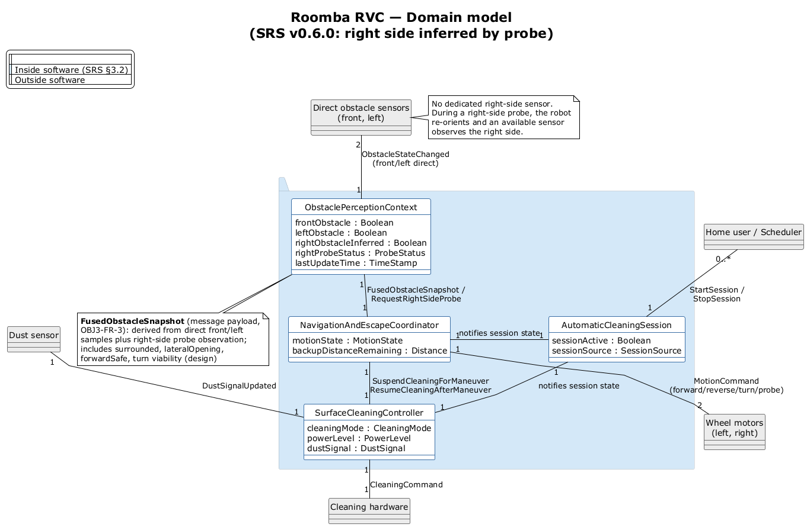

# Roomba RVC — Domain model

Aligned with **`../../01_requirements/RVC_SW_Controller_SRS.md` §3.2** and **`../../02_use_cases/RVC_SW_Controller_UseCases.md`**. This version follows SRS/use case v0.6.0: the RVC has direct front/left obstacle sensing, no dedicated right-side sensor, and infers right-side status through a high-level right-side probe using available sensing.

**Source:** `RVC_domain.puml` · **Re-render:** `powershell -NoProfile -ExecutionPolicy Bypass -File ..\render-diagrams.ps1`

## SRS §3.2 alignment check

| SRS object (§3.2) | On domain model | Attributes (SRS AT-*) | Status |
|-------------------|-----------------|-------------------------|--------|
| **AutomaticCleaningSession** (§3.2.1) | Yes | `sessionActive`, `sessionSource` | Match |
| **SurfaceCleaningController** (§3.2.2) | Yes | `cleaningMode`, `powerLevel`, `dustSignal` | Match |
| **ObstaclePerceptionContext** (§3.2.3) | Yes | `frontObstacle`, `leftObstacle`, `rightObstacleInferred`, `rightProbeStatus`, `lastUpdateTime` | Match |
| **NavigationAndEscapeCoordinator** (§3.2.4) | Yes | `motionState`, `backupDistanceRemaining` | Match |

### Messages on links (SRS §3.2.x.3)

| Link | SRS message(s) | Status |
|------|----------------|--------|
| User → AutomaticCleaningSession | `StartSession`, `StopSession` | Match |
| Direct front/left sensors → ObstaclePerceptionContext | `ObstacleStateChanged` | Match |
| Dust → SurfaceCleaningController | `DustSignalUpdated` | Match |
| AutomaticCleaningSession → Navigation / Cleaning | notifies session state (internal) | Match |
| ObstaclePerceptionContext → NavigationAndEscapeCoordinator | `FusedObstacleSnapshot`, `RequestRightSideProbe` | Match |
| NavigationAndEscapeCoordinator → SurfaceCleaningController | `SuspendCleaningForManeuver`, `ResumeCleaningAfterManeuver` | Match |
| NavigationAndEscapeCoordinator → wheels | `MotionCommand` including forward, reverse, turn, and probe re-orientation | Match |
| SurfaceCleaningController → hardware | `CleaningCommand` | Match |

### What changed from the earlier domain model

| Was | Now |
|-----|-----|
| Obstacle sensors for front / left / right | Direct obstacle sensors for front / left only |
| `rightObstacle` direct attribute | `rightObstacleInferred` derived by right-side probe |
| No probe status attribute | `rightProbeStatus` tracks pending/valid/invalid/stale probe-pose observation |
| Fused picture derived from direct sectors | `FusedObstacleSnapshot` derived from direct front/left samples plus right-side probe observation |
| Navigation sends generic `MotionCommand` | Navigation sends `MotionCommand` for forward/reverse/turn/probe re-orientation |

`FusedObstacleSnapshot` is an SRS **message** (§3.2.3.3 → §3.2.4.3), not a fifth §3.2 object. Its fields are noted on the diagram (derived by OBJ3-FR-3 and OBJ3-FR-5); they are not separate AT-* rows in the SRS.

The right-side probe is not modeled as a separate physical sensor. It is a behavior in which the system commands high-level re-orientation and uses available sensing, such as the front obstacle sensor, to infer right-side status. Exact motor control, angles, and timing remain outside this domain model.

## Multiplicities

| Link | Mult | Note |
|------|------|------|
| User → AutomaticCleaningSession | 0..* — 1 | |
| Direct obstacle sensors → ObstaclePerceptionContext | 2 — 1 | front / left direct sensors (SRS A-1, HI-1) |
| Dust sensor → SurfaceCleaningController | 1 — 1 | |
| Session → Navigation / Cleaning | 1 — 1 | OBJ1-FR-1 |
| ObstaclePerceptionContext → NavigationAndEscapeCoordinator | 1 — 1 | sends fused obstacle picture and requests right-side probe when needed |
| NavigationAndEscapeCoordinator → SurfaceCleaningController | 1 — 1 | |
| NavigationAndEscapeCoordinator → wheel motors | 1 — 2 | physical wheels; logical MotionCommand, including probe re-orientation |
| SurfaceCleaningController → cleaning hardware | 1 — 1 | |

## Change summary for SRS/use case/SSD v0.6.0 alignment

### Changed

- The external obstacle sensor concept changed from front/left/right sensors to direct front/left sensors only.
- `ObstaclePerceptionContext` now keeps inferred right-side state instead of direct right-side state.
- The fused obstacle picture now combines direct front/left observations with right-side probe observations.
- The navigation-to-wheel relationship now explicitly includes probe re-orientation as a high-level motion command.
- Multiplicity from obstacle sensors to `ObstaclePerceptionContext` changed from `3 — 1` to `2 — 1`.

### Added

- `rightObstacleInferred` attribute.
- `rightProbeStatus` attribute for the status of probe-pose observations.
- `RequestRightSideProbe` communication between `ObstaclePerceptionContext` and `NavigationAndEscapeCoordinator`.
- A note explaining that there is no dedicated right-side sensor and that right-side status is inferred by re-orienting the robot and using available sensing.

### Removed

- Direct right-side obstacle sensor as an external domain participant.
- Direct `rightObstacle` attribute.
- The assumption that all three obstacle sectors are directly sensed.
