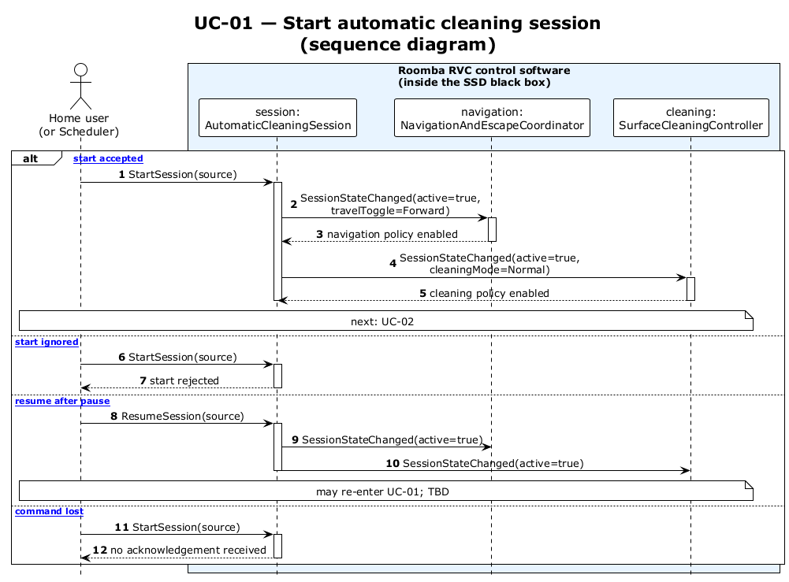

# UC-01 — Start automatic cleaning session (SD)

[← SD index](RVC_SD_Index.md) · [SSD index](../ssd/RVC_SSD_Index.md) · [Domain model](../domain/RVC_Domain_Diagram.md) · Source: `UC01_sequence.puml`

This sequence diagram specifies what happens inside the SSD black box using the domain-model objects:

- `AutomaticCleaningSession`
- `NavigationAndEscapeCoordinator`
- `SurfaceCleaningController`

On accepted start, the session notifies navigation with **`travelToggle=Forward`** and cleaning with **`cleaningMode=Normal`** (OBJ1-FR-4).

**Frames:** `[typical start accepted]` · `[A1 start ignored]` · `[A2 resume after pause]` · `[E1 command lost]`

