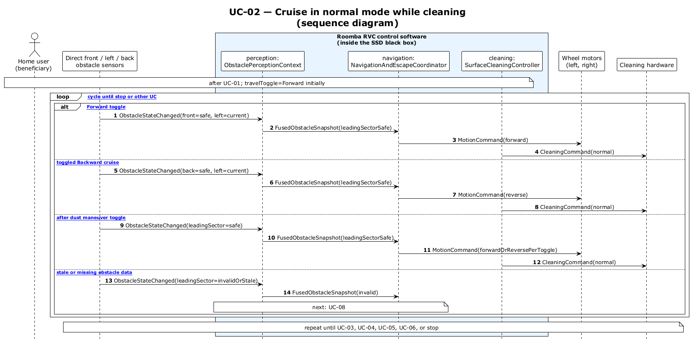

# UC-02 — Cruise in normal mode while cleaning (SD)

[← SD index](RVC_SD_Index.md) · [SSD index](../ssd/RVC_SSD_Index.md) · [Domain model](../domain/RVC_Domain_Diagram.md) · Source: `UC02_sequence.puml`

This sequence diagram opens the SSD black box and shows **leading-sector** obstacle updates flowing through `ObstaclePerceptionContext`, `NavigationAndEscapeCoordinator`, and `SurfaceCleaningController`. Cruise uses **`MotionCommand(forward)`** when Forward toggle and **`MotionCommand(reverse)`** when Backward toggle, with **`CleaningCommand(normal)`** throughout.

**Frames:** `loop [cruise cycle]` — `[typical Forward toggle]` · `[A1 toggled Backward cruise]` · `[A2 after dust maneuver toggle]` · `[E1 stale or missing obstacle data]` → UC-08

