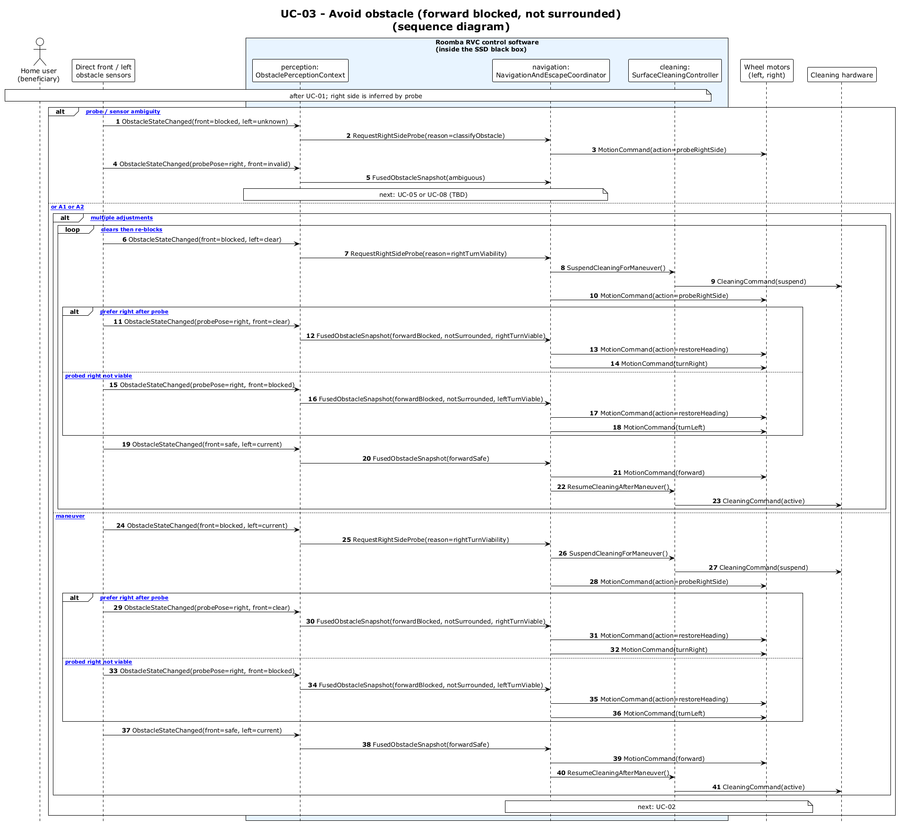

# UC-03 - Avoid Obstacle (Forward Blocked, Not Surrounded) (SD)

[← SD index](RVC_SD_Index.md) · [SSD index](../ssd/RVC_SSD_Index.md) · [Domain model](../domain/RVC_Domain_Diagram.md) · Source: `UC03_sequence.puml`

This sequence diagram opens the SSD black box and shows direct front/left sensing, right-side probe request/re-orientation, obstacle fusion, maneuver selection, cleaning suspension, and resume behavior.

