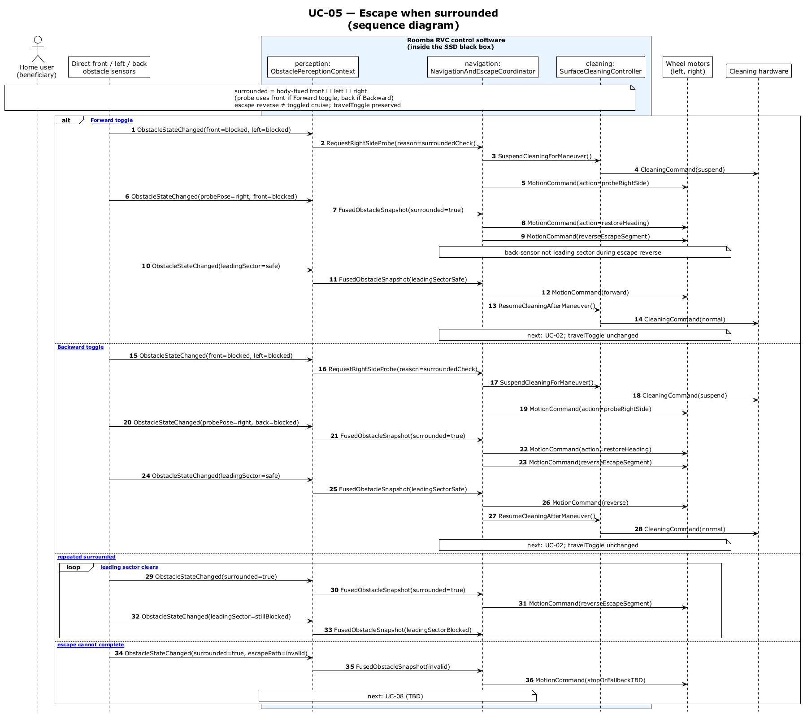

# UC-05 — Escape when surrounded (SD)

[← SD index](RVC_SD_Index.md) · [SSD index](../ssd/RVC_SSD_Index.md) · [Domain model](../domain/RVC_Domain_Diagram.md) · Source: `UC05_sequence.puml`

This sequence diagram shows surrounded detection using body-fixed front + left + probed right (probe sensor per toggle), a required **reverse escape segment** (not toggled cruise), and exit along the **leading travel sector** per preserved **`travelToggle`**. Back sensor is **not** the leading sector during escape reverse but is used for the right-side probe when toggled Backward.

**Frames:** `[typical Forward toggle]` · `[typical Backward toggle]` · `[A1 repeated surrounded]` · `[E1 escape cannot complete]`

