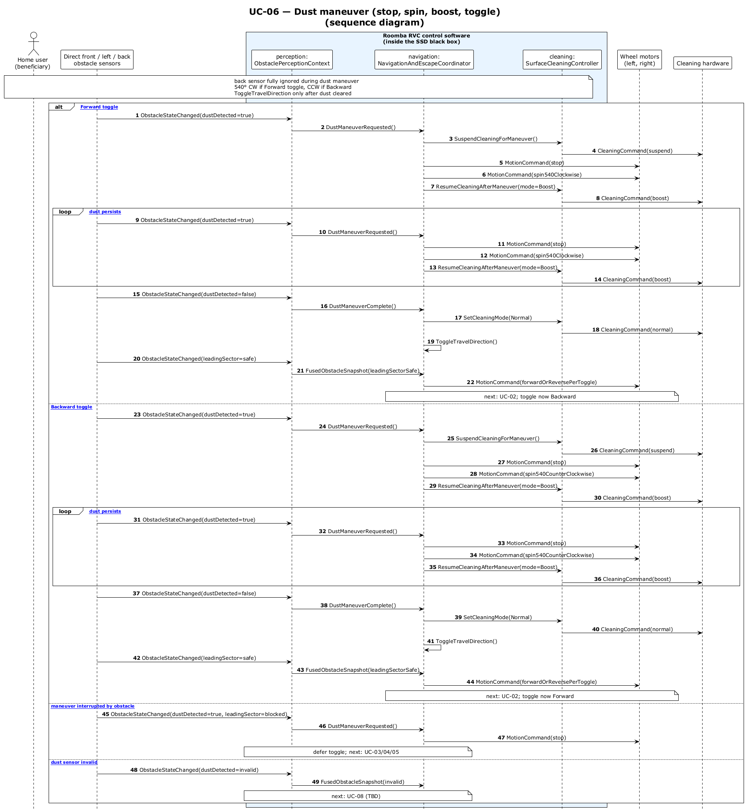

# UC-06 — Perform dust maneuver (spin, boost, toggle travel) (SD)

[← SD index](RVC_SD_Index.md) · [SSD index](../ssd/RVC_SSD_Index.md) · [Domain model](../domain/RVC_Domain_Diagram.md) · Source: `UC06_sequence.puml`

This sequence diagram shows dust detection triggering **`NavigationAndEscapeCoordinator`** to stop and spin **540°** (CW if Forward toggle, CCW if Backward), **`SurfaceCleaningController`** Boost loop while dust persists, return to **Normal**, **`ToggleTravelDirection()`**, and resume cruise. Back sensor is **fully ignored** during the maneuver.

**Frames:** `[typical Forward toggle]` · `[typical Backward toggle]` · `[A1 maneuver interrupted by obstacle]` · `[E1 dust sensor invalid]`

