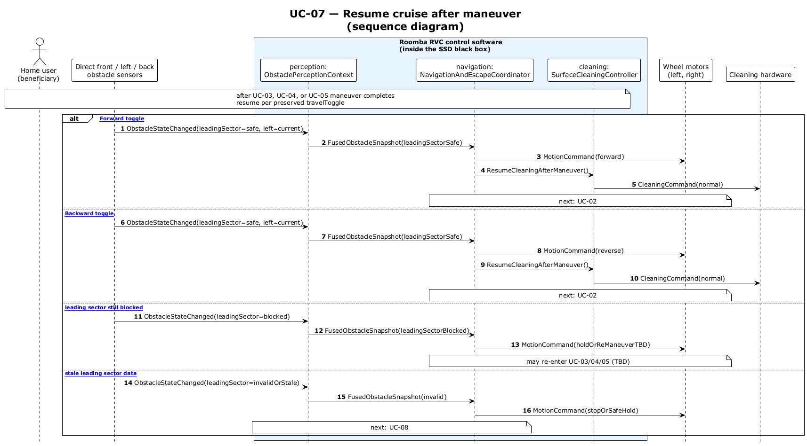

# UC-07 — Resume normal cruise after a maneuver (SD)

[← SD index](RVC_SD_Index.md) · [SSD index](../ssd/RVC_SSD_Index.md) · [Domain model](../domain/RVC_Domain_Diagram.md) · Source: `UC07_sequence.puml`

This sequence diagram shows **leading-sector-safe** perception, forward or reverse motion per **`travelToggle`**, and **`CleaningCommand(normal)`** resume after UC-03, UC-04, or UC-05.

**Frames:** `[typical Forward toggle]` · `[typical Backward toggle]` · `[A1 leading sector still blocked]` · `[E1 stale leading sector data]` → UC-08

