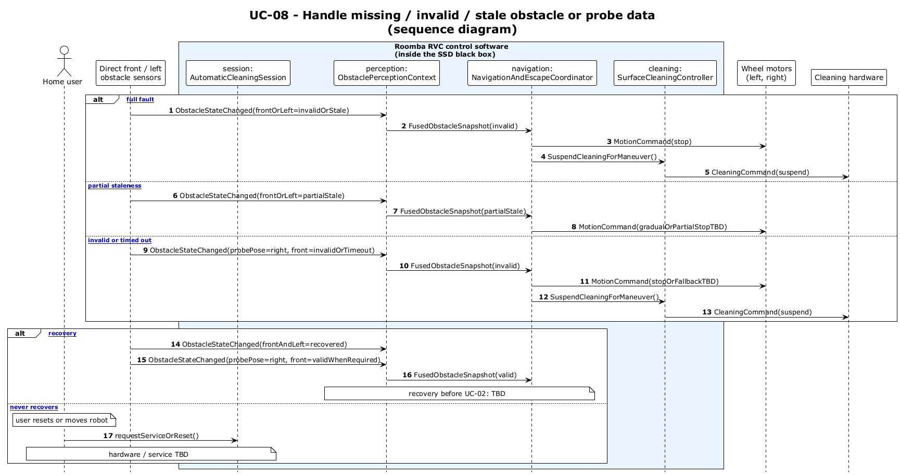

# UC-08 - Handle Missing / Invalid / Stale Obstacle or Probe Data (SD)

[← SD index](RVC_SD_Index.md) · [SSD index](../ssd/RVC_SSD_Index.md) · [Domain model](../domain/RVC_Domain_Diagram.md) · Source: `UC08_sequence.puml`

This sequence diagram shows invalid direct obstacle data or invalid right-side probe-pose observations flowing to safe motion and cleaning behavior.

