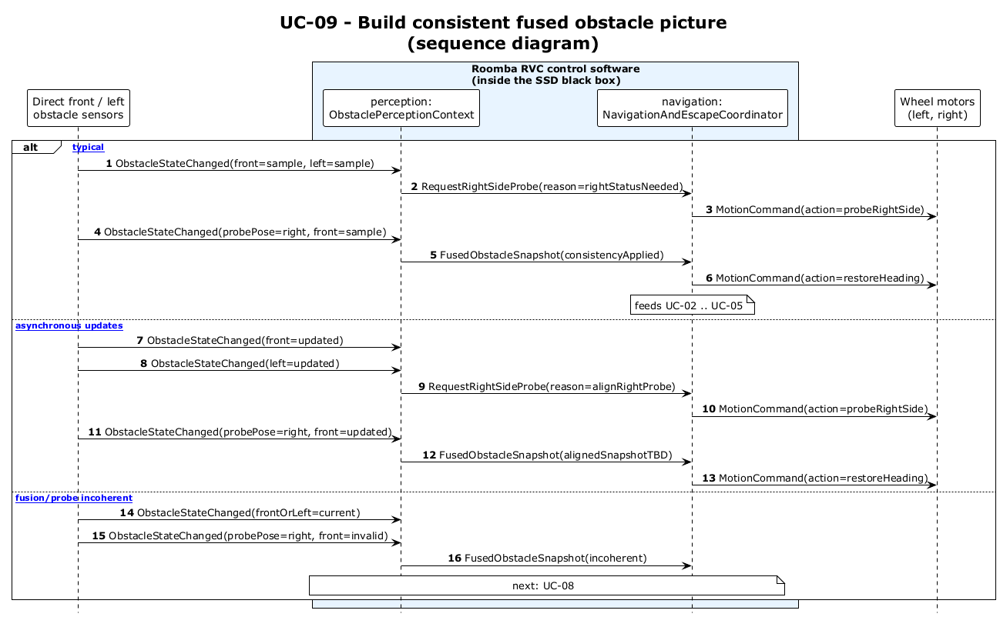

# UC-09 - Build Consistent Fused Obstacle Picture (SD)

[← SD index](RVC_SD_Index.md) · [SSD index](../ssd/RVC_SSD_Index.md) · [Domain model](../domain/RVC_Domain_Diagram.md) · Source: `UC09_sequence.puml`

This sequence diagram shows direct front/left updates and right-side probe-pose observations becoming a `FusedObstacleSnapshot` for navigation decisions.

