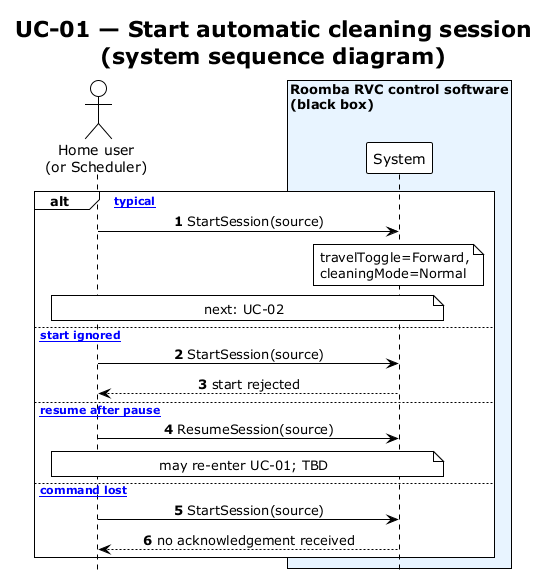

# UC-01 — Start automatic cleaning session (SSD)

[← SSD index](RVC_SSD_Index.md) · Source: `UC01_system_sequence.puml`

**Frames:** `[typical]` (sets `travelToggle=Forward`, `cleaningMode=Normal`) · `[A1 start ignored]` · `[A2 resume after pause]` · `[E1 command lost]`

