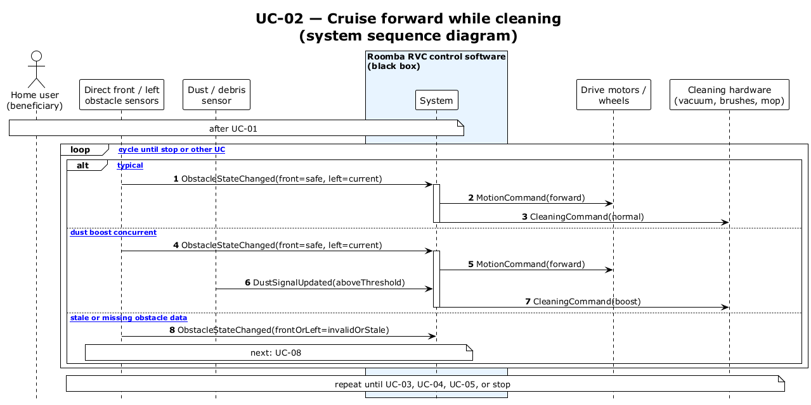

# UC-02 — Cruise forward while cleaning (SSD)

[← SSD index](RVC_SSD_Index.md) · Source: `UC02_system_sequence.puml`

**Frames:** `loop [cruise cycle until stop or other UC]` — `[typical]` · `[A1 dust boost concurrent]` · `[E1 stale or missing obstacle data]` → UC-08

