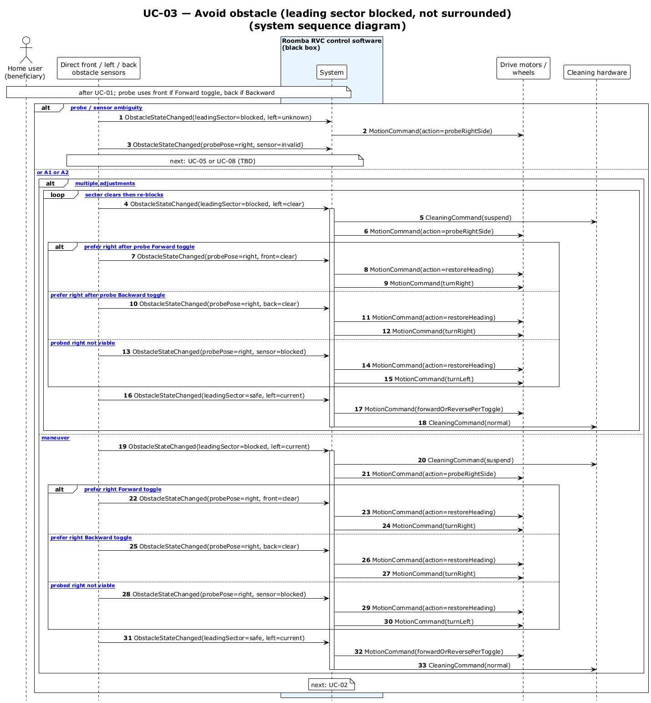

# UC-03 — Avoid obstacle (leading sector blocked, not surrounded) (SSD)

[← SSD index](RVC_SSD_Index.md) · Source: `UC03_system_sequence.puml`

**Frames:** `[E1 probe / sensor ambiguity]` → UC-05 / UC-08 · else `[typical or A1 or A2]` · leading sector blocked · probe via **front** (Forward toggle) or **back** (Backward toggle) · resume `forwardOrReversePerToggle`

