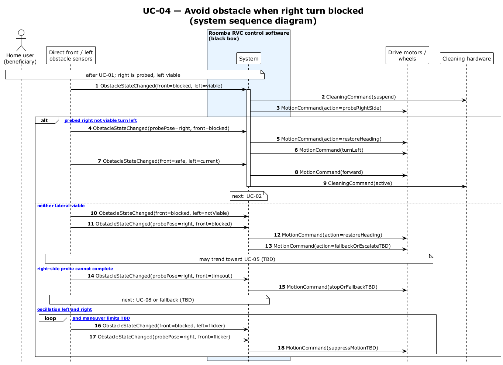

# UC-04 — Avoid obstacle when right turn is blocked (SSD)

[← SSD index](RVC_SSD_Index.md) · Source: `UC04_system_sequence.puml`

**Frames:** right-side probe · `[typical probed right not viable turn left]` · `[A1 neither lateral viable]` · `[A2 right-side probe cannot complete]` → UC-08 / fallback · `[E1 oscillation left and right]` · `loop [debounce and maneuver limits TBD]`

