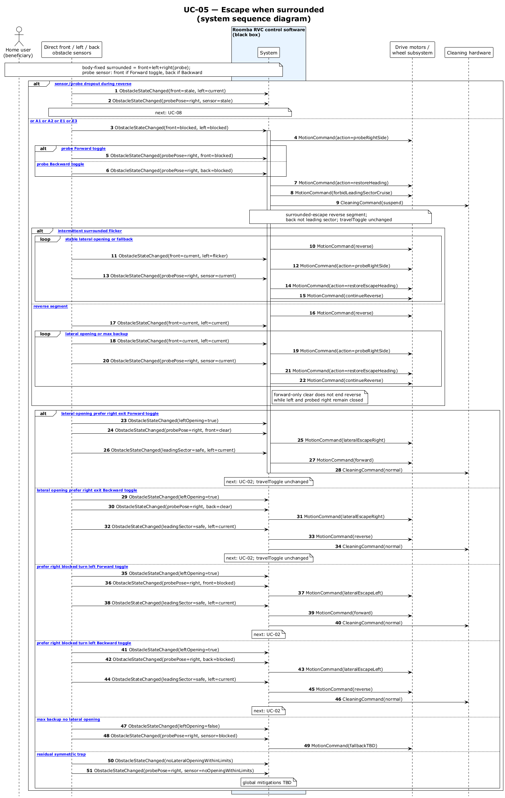

# UC-05 — Escape when surrounded (SSD)

[← SSD index](RVC_SSD_Index.md) · Source: `UC05_system_sequence.puml`

**Frames:** `[E2 sensor/probe dropout]` → UC-08 · surrounded reverse segment · probe via **front** or **back** per toggle · lateral exit · `[forward]` or `[reverse]` resume per preserved `travelToggle` · `[E1 max backup]` · `[E3 residual trap]`

