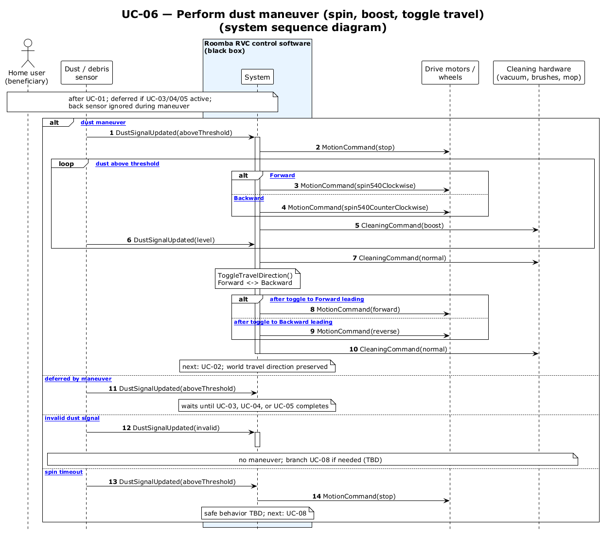

# UC-06 — Perform dust maneuver (spin, boost, toggle travel) (SSD)

[← SSD index](RVC_SSD_Index.md) · Source: `UC06_system_sequence.puml`

**Frames:** `[typical]` stop · 540° spin loop · Boost · `ToggleTravelDirection` · resume per toggle · `[A1 deferred by UC-03/04/05]` · `[E1 invalid dust]` · `[E2 spin timeout]`

