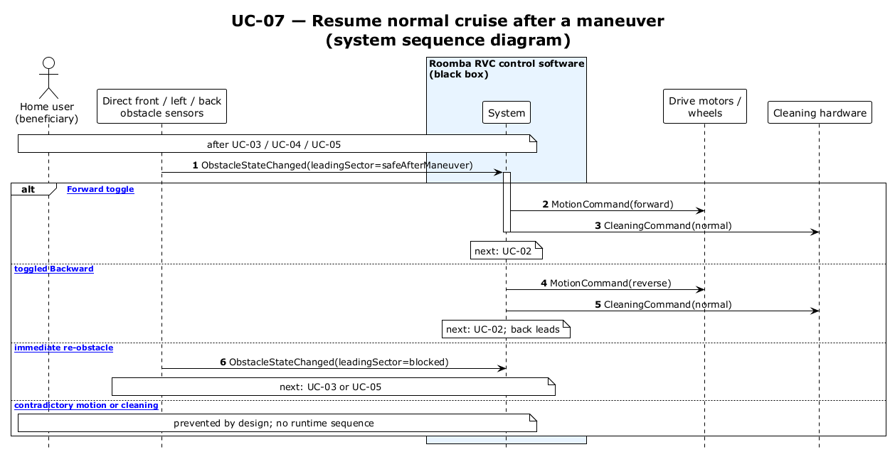

# UC-07 — Resume normal cruise after a maneuver (SSD)

[← SSD index](RVC_SSD_Index.md) · Source: `UC07_system_sequence.puml`

**Frames:** after UC-03 / UC-04 / UC-05 · `[typical Forward toggle]` → UC-02 · `[A2 toggled Backward]` reverse resume · `[A1 immediate re-obstacle]` → UC-03 / UC-05

