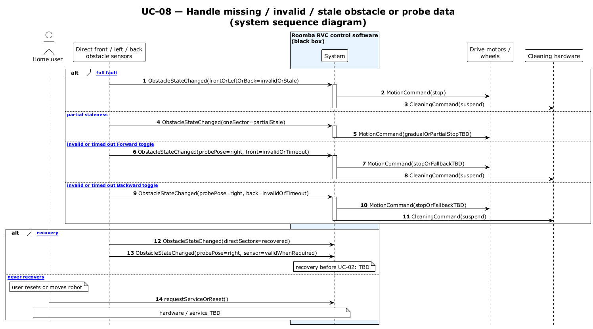

# UC-08 — Handle missing / invalid / stale obstacle or probe data (SSD)

[← SSD index](RVC_SSD_Index.md) · Source: `UC08_system_sequence.puml`

**Frames:** `[typical full fault]` · `[A1 partial staleness]` · probe timeout on **front** or **back** sensor · recovery or `[E1 never recovers]`

