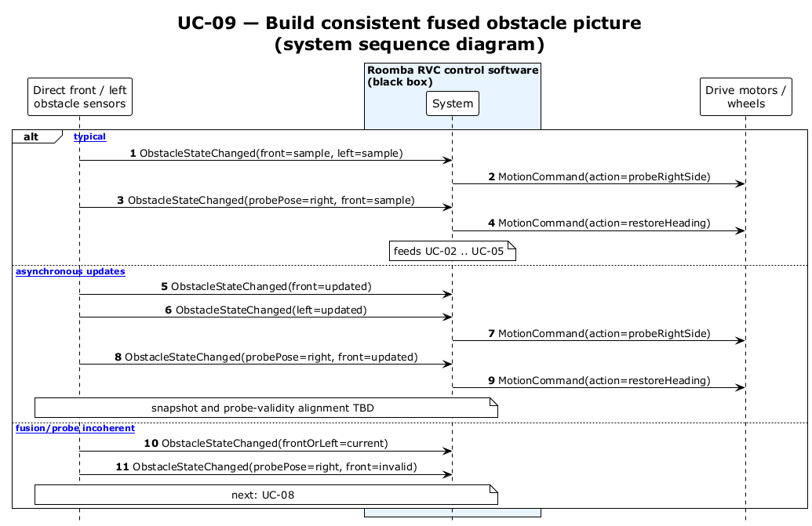

# UC-09 — Build consistent fused obstacle picture (SSD)

[← SSD index](RVC_SSD_Index.md) · Source: `UC09_system_sequence.puml`

**Frames:** `[typical]` combines direct front/left samples with right-side probe result · `[A1 asynchronous updates]` aligns timestamps and probe validity · `[E1 fusion/probe incoherent]` → UC-08

