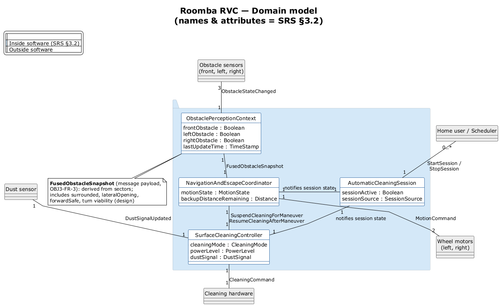

# Roomba RVC — Domain model

Aligned with **`RVC_SW_Controller_SRS.md` §3.2** (object names, attributes, messages). Multiplicities follow SSDs / physical structure (3 sectors, 2 wheels).

**Source:** `plantuml/RVC_domain.puml` · **Re-render:** `powershell -NoProfile -ExecutionPolicy Bypass -File .\diagrams\render-diagrams.ps1`

## SRS §3.2 alignment check

| SRS object (§3.2) | On domain model | Attributes (SRS AT-*) | Status |
|-------------------|-----------------|-------------------------|--------|
| **AutomaticCleaningSession** (§3.2.1) | Yes | `sessionActive`, `sessionSource` | Match |
| **SurfaceCleaningController** (§3.2.2) | Yes | `cleaningMode`, `powerLevel`, `dustSignal` | Match |
| **ObstaclePerceptionContext** (§3.2.3) | Yes | `frontObstacle`, `leftObstacle`, `rightObstacle`, `lastUpdateTime` | Match |
| **NavigationAndEscapeCoordinator** (§3.2.4) | Yes | `motionState`, `backupDistanceRemaining` | Match |

### Messages on links (SRS §3.2.x.3)

| Link | SRS message(s) | Status |
|------|----------------|--------|
| User → AutomaticCleaningSession | `StartSession`, `StopSession` | Match |
| Sensors → ObstaclePerceptionContext | `ObstacleStateChanged` | Match |
| Dust → SurfaceCleaningController | `DustSignalUpdated` | Match |
| AutomaticCleaningSession → Navigation / Cleaning | notifies session state (internal) | Match |
| ObstaclePerceptionContext → NavigationAndEscapeCoordinator | `FusedObstacleSnapshot` | Match |
| NavigationAndEscapeCoordinator → SurfaceCleaningController | `SuspendCleaningForManeuver`, `ResumeCleaningAfterManeuver` | Match |
| NavigationAndEscapeCoordinator → wheels | `MotionCommand` | Match |
| SurfaceCleaningController → hardware | `CleaningCommand` | Match |

### What changed from the shorter diagram

| Was (informal) | Now (SRS) |
|----------------|-----------|
| CleaningSession | AutomaticCleaningSession |
| ObstaclePerception | ObstaclePerceptionContext |
| NavigationCoordinator | NavigationAndEscapeCoordinator |
| CleaningController | SurfaceCleaningController |
| frontSector / leftSector / rightSector | frontObstacle / leftObstacle / rightObstacle |
| motionPhase, backupRemaining | motionState, backupDistanceRemaining |
| treatmentState | cleaningMode |
| fusedPicture : FusedObstacle | (payload named on link) **FusedObstacleSnapshot** |

`FusedObstacleSnapshot` is an SRS **message** (§3.2.3.3 → §3.2.4.3), not a fifth §3.2 object. Its fields are noted on the diagram (derived by OBJ3-FR-3); they are not separate AT-* rows in the SRS.

## Multiplicities

| Link | Mult | Note |
|------|------|------|
| User → AutomaticCleaningSession | 0..* — 1 | |
| Obstacle sensors → ObstaclePerceptionContext | 3 — 1 | front / left / right (SRS A-1) |
| Dust sensor → SurfaceCleaningController | 1 — 1 | |
| Session → Navigation / Cleaning | 1 — 1 | OBJ1-FR-1 |
| ObstaclePerceptionContext → NavigationAndEscapeCoordinator | 1 — 1 | |
| NavigationAndEscapeCoordinator → SurfaceCleaningController | 1 — 1 | |
| NavigationAndEscapeCoordinator → wheel motors | 1 — 2 | physical wheels; logical MotionCommand |
| SurfaceCleaningController → cleaning hardware | 1 — 1 | |

## Optional code aliases (not on diagram)

If you want shorter C++ typedefs in code only:

`using CleaningSession = AutomaticCleaningSession;` etc. — diagram and SRS stay on the full names above.
