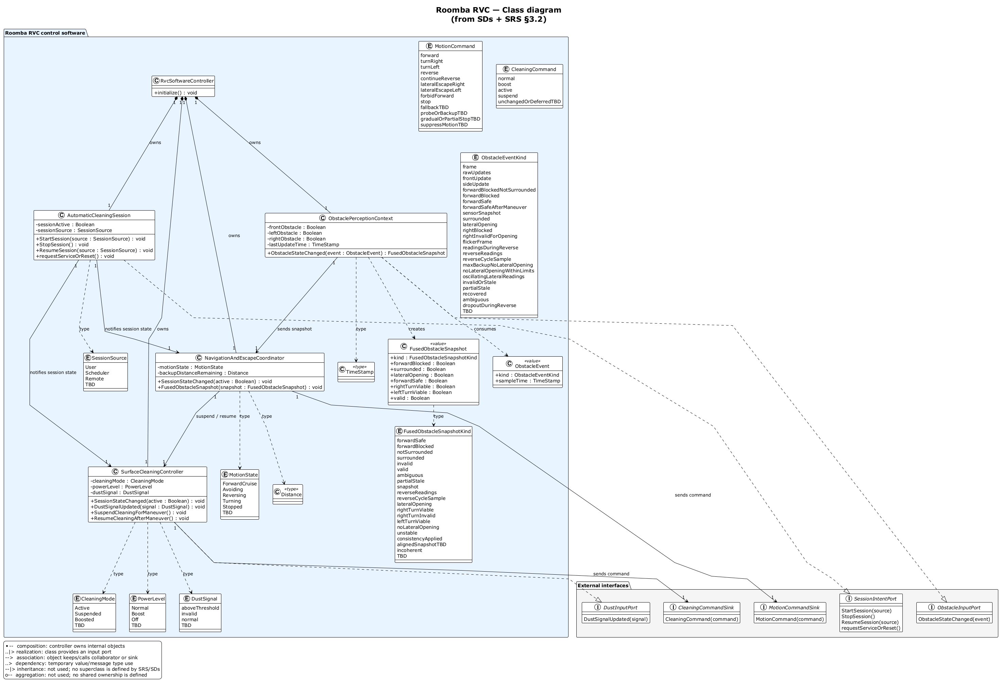

# Roomba RVC — Class Diagram

Companion to the [SD gallery](../sd/RVC_SD_Index.md), [SSD gallery](../RVC_SSD_Index.md), and [domain model](../RVC_Domain_Diagram.md).

This class diagram is based on:

- SRS §3.2 object names and attributes
- SD messages (`StartSession`, `ObstacleStateChanged`, `FusedObstacleSnapshot`, `MotionCommand`, `CleaningCommand`, etc.)
- External actors / hardware as interfaces, not internal classes

**Source:** `class/RVC_class.puml`  
**Re-render:** `powershell -NoProfile -ExecutionPolicy Bypass -File .\diagrams\render-diagrams.ps1`

## Main Classes

| Class | Source |
|-------|--------|
| `AutomaticCleaningSession` | SRS §3.2.1, UC-01 SD |
| `SurfaceCleaningController` | SRS §3.2.2, UC-02 / UC-06 SD |
| `ObstaclePerceptionContext` | SRS §3.2.3, UC-03 / UC-05 / UC-08 / UC-09 SD |
| `NavigationAndEscapeCoordinator` | SRS §3.2.4, UC-02–UC-05 / UC-07 / UC-08 SD |
| `FusedObstacleSnapshot` | SRS message payload, SD message from perception to navigation |

## External Interfaces

| Interface | Represents |
|-----------|------------|
| `SessionIntentPort` | Home user / scheduler intent |
| `ObstacleInputPort` | Front / left / right obstacle sensor updates |
| `DustInputPort` | Dust or debris-load signal |
| `MotionCommandSink` | Wheel motors / lower motion layer |
| `CleaningCommandSink` | Vacuum / brush / mop hardware command sink |

## Notes

- `FusedObstacleSnapshot` is modeled as a value object because the SDs pass it repeatedly from `ObstaclePerceptionContext` to `NavigationAndEscapeCoordinator`.
- `FusedObstacleSnapshotKind` covers the named snapshot states used in SD labels, such as `forwardSafe`, `invalid`, `rightTurnViable`, `noLateralOpening`, and `incoherent`.
- Receiver operations match the SDs: `MotionCommand()` belongs to `MotionCommandSink`, and `CleaningCommand()` belongs to `CleaningCommandSink`.
- `RvcSoftwareController` is a composition root for the four SRS §3.2 objects; it reflects the software controller component in SRS §2.1.
- Realization (`..|>`) is used where a class provides an input port: session intent, obstacle input, and dust input.
- Inheritance and aggregation are intentionally not used because the SRS/SDs do not define parent/child classes or shared ownership.
- TBD variants remain explicit in enums/commands (for example `fallbackTBD`, `probeOrBackupTBD`) instead of inventing final product behavior.
- This diagram shows software structure; exact driver/HAL implementation remains outside the SRS scope.
