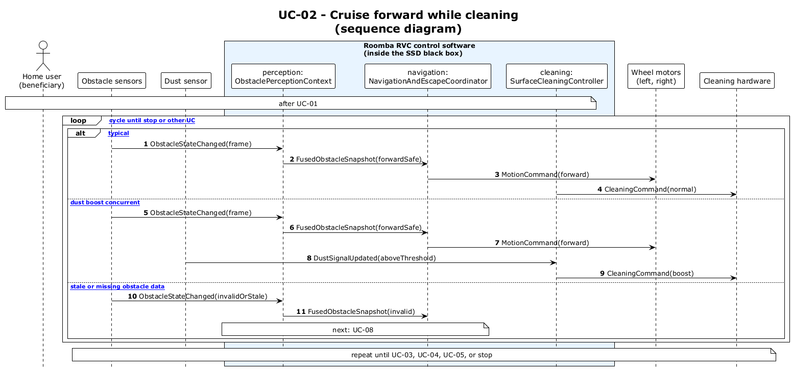

# UC-02 - Cruise Forward While Cleaning (SD)

[← SD index](RVC_SD_Index.md) · [SSD index](../RVC_SSD_Index.md) · [Domain model](../RVC_Domain_Diagram.md) · Source: `sd/UC02_sequence.puml`

This sequence diagram opens the SSD black box and shows interactions between `ObstaclePerceptionContext`, `NavigationAndEscapeCoordinator`, and `SurfaceCleaningController`.

