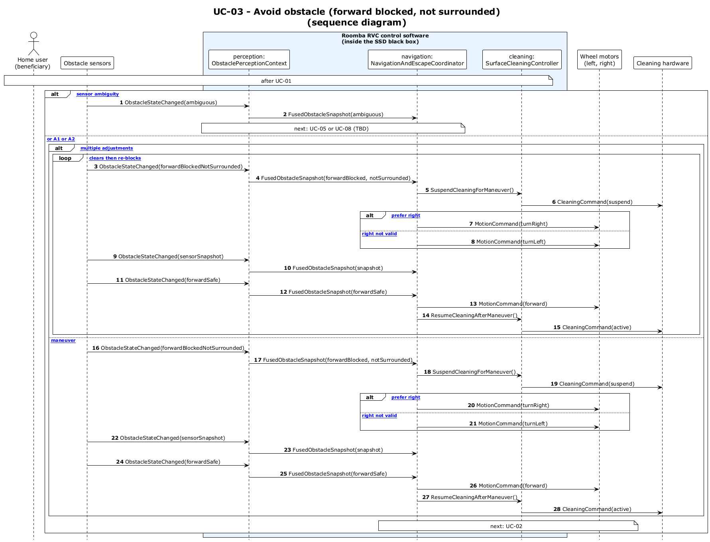

# UC-03 - Avoid Obstacle (Forward Blocked, Not Surrounded) (SD)

[← SD index](RVC_SD_Index.md) · [SSD index](../RVC_SSD_Index.md) · [Domain model](../RVC_Domain_Diagram.md) · Source: `sd/UC03_sequence.puml`

This sequence diagram opens the SSD black box and shows obstacle fusion, maneuver selection, cleaning suspension, and resume behavior.

