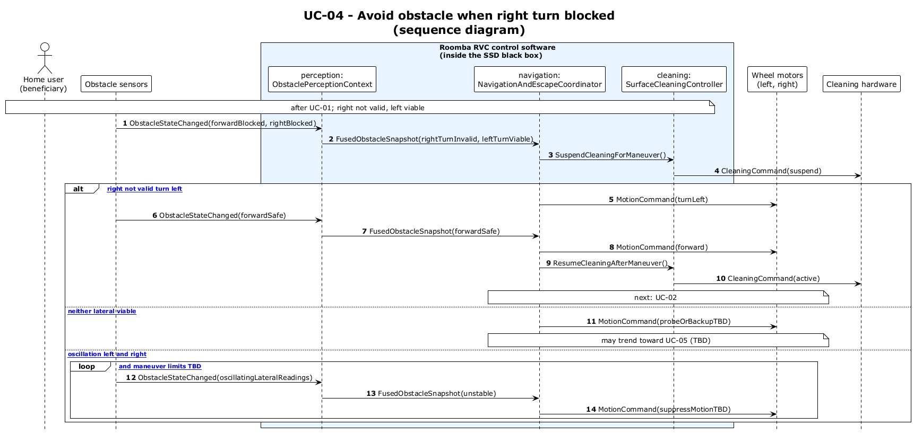

# UC-04 - Avoid Obstacle When Right Turn Is Blocked (SD)

[← SD index](RVC_SD_Index.md) · [SSD index](../RVC_SSD_Index.md) · [Domain model](../RVC_Domain_Diagram.md) · Source: `sd/UC04_sequence.puml`

This sequence diagram shows the inside behavior when right is not viable and the coordinator chooses left or a TBD fallback branch.

