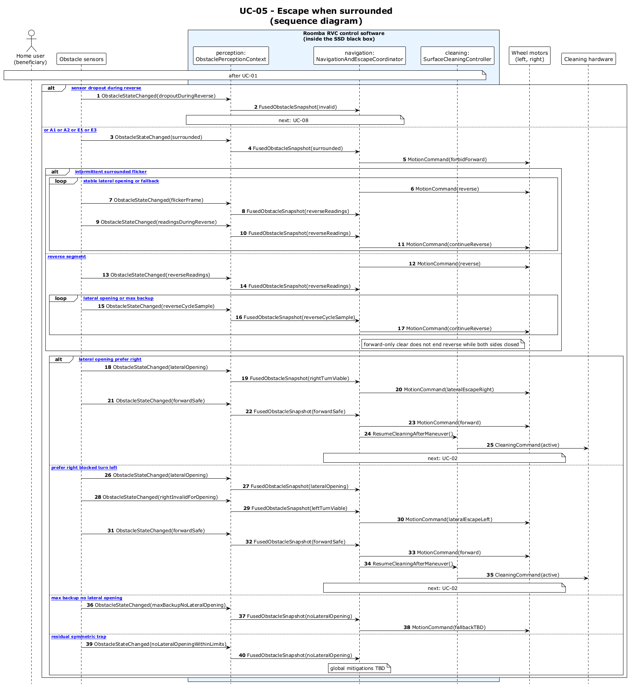

# UC-05 - Escape When Surrounded (SD)

[← SD index](RVC_SD_Index.md) · [SSD index](../RVC_SSD_Index.md) · [Domain model](../RVC_Domain_Diagram.md) · Source: `sd/UC05_sequence.puml`

This sequence diagram shows surrounded detection, reverse looping, lateral opening handling, and fallback / dropout branches.

