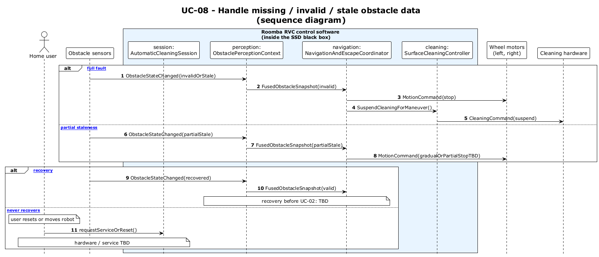

# UC-08 - Handle Missing / Invalid / Stale Obstacle Data (SD)

[← SD index](RVC_SD_Index.md) · [SSD index](../RVC_SSD_Index.md) · [Domain model](../RVC_Domain_Diagram.md) · Source: `sd/UC08_sequence.puml`

This sequence diagram shows invalid perception data flowing to safe motion and cleaning behavior.

