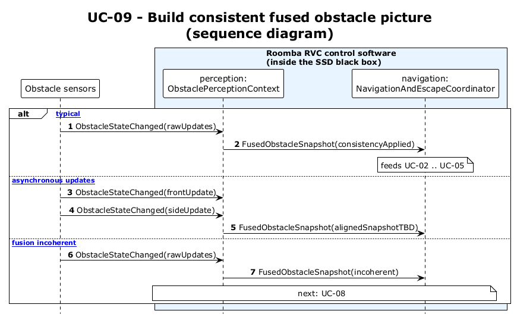

# UC-09 - Build Consistent Fused Obstacle Picture (SD)

[← SD index](RVC_SD_Index.md) · [SSD index](../RVC_SSD_Index.md) · [Domain model](../RVC_Domain_Diagram.md) · Source: `sd/UC09_sequence.puml`

This sequence diagram shows raw obstacle updates becoming a `FusedObstacleSnapshot` for navigation decisions.

