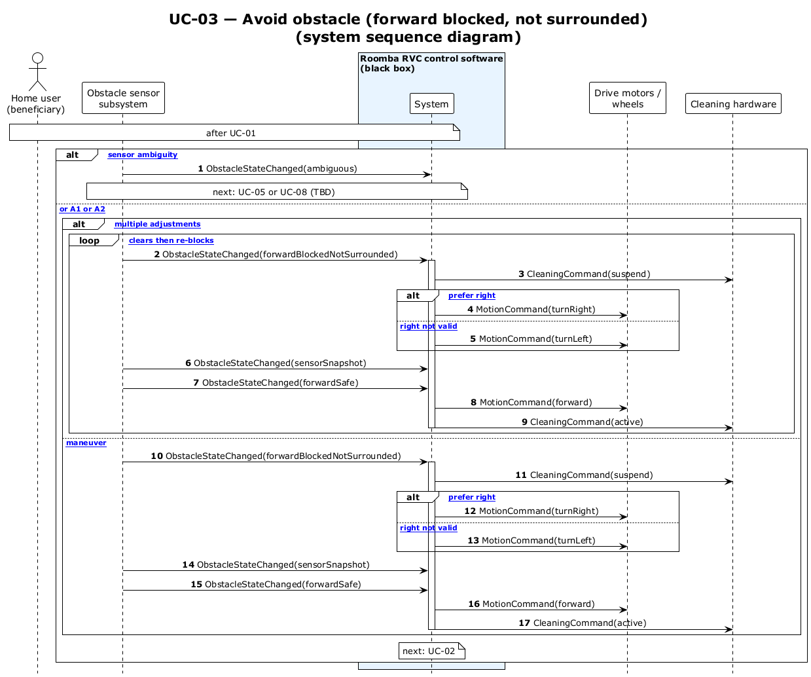

# UC-03 — Avoid obstacle (forward blocked, not surrounded) (SSD)

[← SSD index](../RVC_SSD_Index.md) · Source: `plantuml/UC03_system_sequence.puml`

**Frames:** `[E1 sensor ambiguity]` → UC-05 / UC-08 · else `[typical or A1 or A2]` · `[A2 multiple adjustments]` loop or `[single maneuver]` · `[typical prefer right]` / `[A1 right not valid]`

