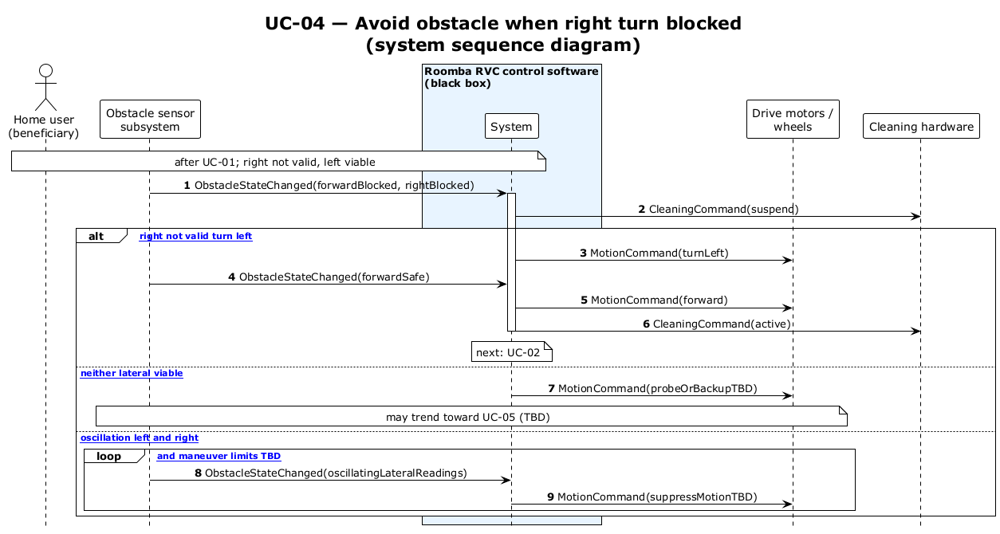

# UC-04 — Avoid obstacle when right turn is blocked (SSD)

[← SSD index](../RVC_SSD_Index.md) · Source: `plantuml/UC04_system_sequence.puml`

**Frames:** `[typical right not valid turn left]` · `[A1 neither lateral viable]` · `[E1 oscillation left and right]` · `loop [debounce and maneuver limits TBD]`

