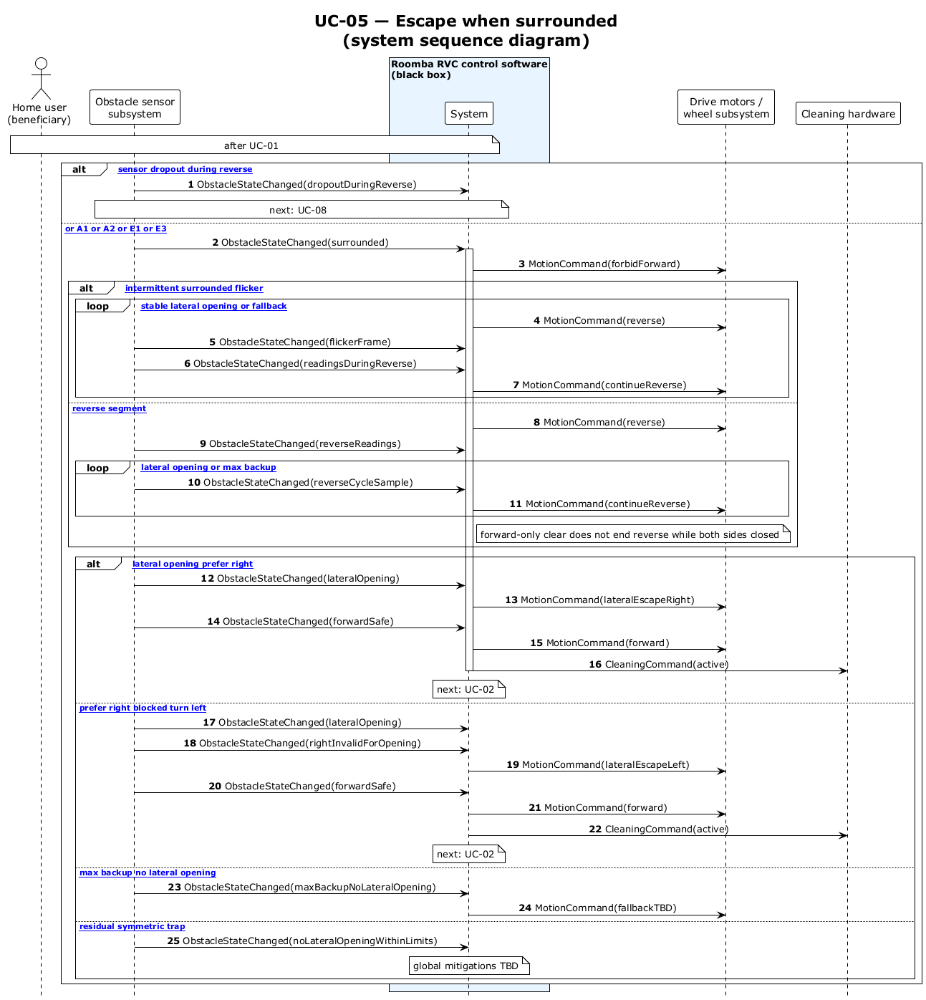

# UC-05 — Escape when surrounded (SSD)

[← SSD index](../RVC_SSD_Index.md) · Source: `plantuml/UC05_system_sequence.puml`

**Frames:** `[E2 sensor dropout during reverse]` → UC-08 · else `[typical or A1 or A2 or E1 or E3]` · reverse: `[A2 intermittent surrounded flicker]` loop or `[typical reverse segment]` loop · exit: `[typical lateral opening prefer right]` · `[A1 prefer right blocked turn left]` · `[E1 max backup no lateral opening]` · `[E3 residual symmetric trap]`

