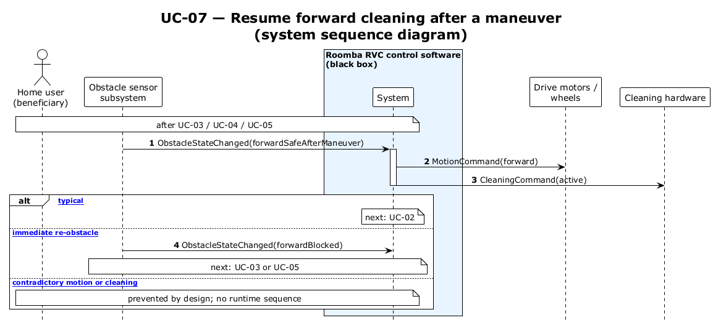

# UC-07 — Resume forward cleaning after a maneuver (SSD)

[← SSD index](../RVC_SSD_Index.md) · Source: `plantuml/UC07_system_sequence.puml`

**Frames:** after UC-03 / UC-04 / UC-05 · `[typical]` → UC-02 · `[A1 immediate re-obstacle]` → UC-03 / UC-05 · `[E1 contradictory motion or cleaning]` (design)

