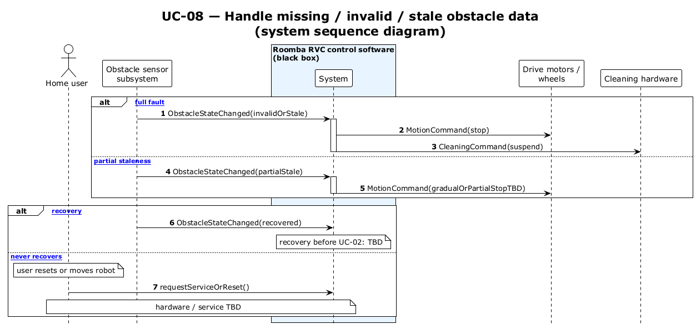

# UC-08 — Handle missing / invalid / stale obstacle data (SSD)

[← SSD index](../RVC_SSD_Index.md) · Source: `plantuml/UC08_system_sequence.puml`

**Frames:** fault: `[typical full fault]` · `[A1 partial staleness]` · recovery: `[typical recovery]` · `[E1 never recovers]`

