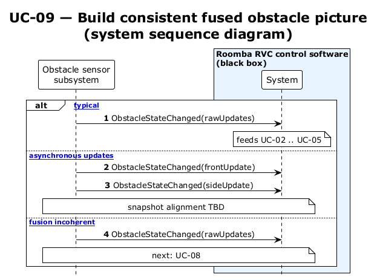

# UC-09 — Build consistent fused obstacle picture (SSD)

[← SSD index](../RVC_SSD_Index.md) · Source: `plantuml/UC09_system_sequence.puml`

**Frames:** `[typical]` · `[A1 asynchronous updates]` · `[E1 fusion incoherent]` → UC-08

